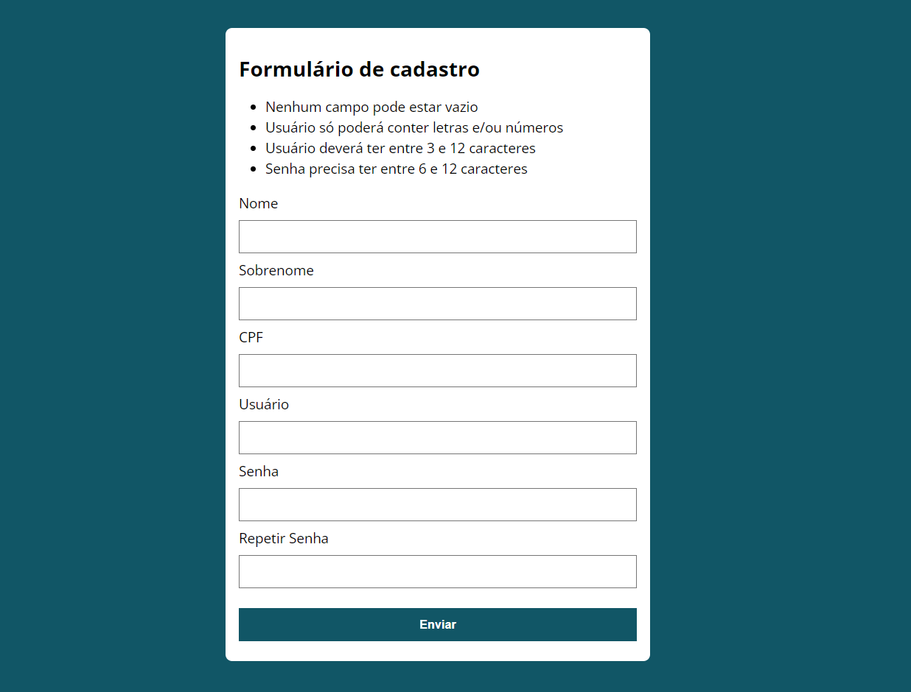
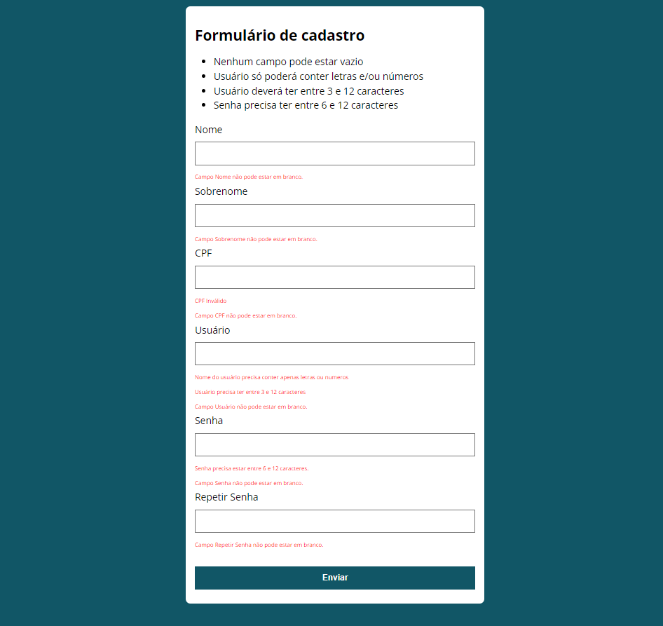

# Validação de Formulário em JavaScript

Este é um projeto de validação de formulário em JavaScript, onde desenvolvi um formulário dinâmico que realiza validações em tempo real dos campos, garantindo que os dados inseridos sejam corretos e evitando erros no envio. O projeto foi criado como uma forma de praticar meus conhecimentos em desenvolvimento web, especialmente manipulação do DOM e validação de dados com JavaScript.

## Funcionalidades Principais

- Validação de campos obrigatórios.
- Validação de CPF.
- Validação de senha e confirmação de senha.
- Exibição de mensagens de erro em tempo real.

## Como Usar

1. Clone este repositório em sua máquina local:

2. Navegue até o diretório do projeto:

3. Abra o arquivo `index.html` em seu navegador para visualizar o projeto.

## Tecnologias Utilizadas

- HTML
- CSS
- JavaScript

## Capturas de Tela

  

  

## Contribuindo

Contribuições são bem-vindas! Se você quiser melhorar este projeto ou adicionar novas funcionalidades, sinta-se à vontade para abrir uma issue ou enviar um pull request.

## Licença

Este projeto está sob a licença [Nome da Licença]. Veja o arquivo [LICENSE.md](LICENSE.md) para mais detalhes.

---

Espero que este README ajude a fornecer uma visão geral do seu projeto para outras pessoas que visitem o repositório no GitHub. Lembre-se de substituir "[Nome da Licença]" pela licença que você pretende utilizar para o projeto (por exemplo, MIT, Apache, etc.).

Personalize o README de acordo com as informações específicas do seu projeto e deixe-o o mais claro e informativo possível. Boa sorte com o compartilhamento do seu projeto no GitHub! 🚀👍
